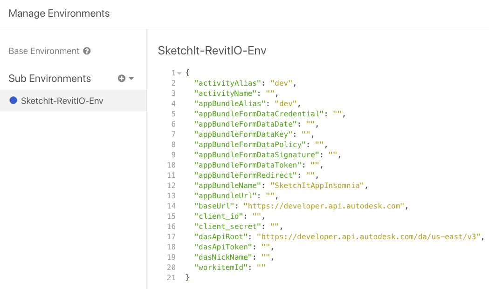

# Create App, Define Activity, Call the WorkItem

## Description
Insomnia.REST workflow to create App, define activity, and call the WorkItem. 

## Setup
`Before start with Design Automaiton workflow, I strongly recommend you to read throught all the details at` [Design Automation for Revit Documenation](https://forge.autodesk.com/en/docs/design-automation/v3),` and check the following steps if you already have basic understanding.`

1. Download or update Insomnia.REST from [here](https://insomnia.rest/download).

2. Create a Forge App. If you have already created a Forge App then you can skip this and proceed to the next step. 

3. From your local clone of the repository, import our `Insomnia data` [Sketchit-App_Insomnia](./SketchIt-App_Insomnia.json) into the Insomnia REST application.  You can find more details about it [here](https://support.insomnia.rest/article/52-importing-and-exporting-data)

 

4. After the import to Insomnia, we can see there is a predefined Enviorment called [SketchIt-RevitIO-Env](Sketchit-App_Insomnia-ENV.json) 
which will need your input for the variable values (client ID, client Secret...) This will make the process smoother and faster to use. You can find more details about it [here](https://support.insomnia.rest/article/18-environment-variables)

 

5. Select the environment and enter your [Forge App's](https://developer.autodesk.com/myapps) `Client ID` and `Client Secret`. This is used for authentication. In the environment variables give your app an easy to manage unique nickname.

6. Compile and package the sample applications as noted [here](https://forge.autodesk.com/en/docs/design-automation/v3/tutorials/revit/step4-publish-appbundle/). You will need this to upload the app to Design Automation. Alternatively you may also download the packages from [SketchIt.zip](../Revit.Addin/SketchItApp/bundles/SketchIt.zip).

7. Create a nickname for your Forge App.

8. Publish your Design Automation appbundle.

Create an `appbundle` zip package from the build outputs and publish the `appbundle` to Design Automation.

The `JSON` in your appbundle POST should look like this:
```json
{
  "id": "SketchItApp",
  "engine": "Autodesk.Revit+2019",
  "description": "SketchIt appbundle based on Revit 2019"
}
```
Notes:
* `engine` = `Autodesk.Revit+2019` - A list of engine versions can be found [here](https://forge.autodesk.com/en/docs/design-automation/v3/tutorials/revit/step4-publish-appbundle/#engine-version-aliases).

After you upload the `appbundle` zip package, you should create an alias for this appbundle. The `JSON` in the POST should look like this:
```json
{
  "version": 1,
  "id": "test"
}
```

> **The instructions for these steps and more about `appbundle` are [here](https://forge.autodesk.com/en/docs/design-automation/v3/tutorials/revit/step4-publish-appbundle/)**.

9. Publish your Design Automation activity.

Define an `activity` to run against the `appbundle`.

The `JSON` that accompanies the `activity` POST will look like this:

```json
{
   "id": "SketchItActivity",
   "commandLine": [ "$(engine.path)\\\\revitcoreconsole.exe /al $(appbundles[SketchItApp].path)" ],
   "parameters": {
      "sketchItInput": {
         "zip": false,
         "ondemand": false,
         "verb": "get",
         "description": "SketchIt input parameters",
         "required": true,
         "localName": "SketchItInput.json"
      },
      "result": {
         "zip": false,
         "ondemand": false,
         "verb": "put",
         "description": "Results",
         "required": true,
         "localName": "sketchIt.rvt"
      }
   },
   "engine": "Autodesk.Revit+2019",
   "appbundles": [ "YourNickname.SketchItApp+test" ],
   "description": "Creates walls and floors from an input JSON file."
}
```
Notes:
*  `engine` = `Autodesk.Revit+2019` - A list of engine versions can be found [here](https://forge.autodesk.com/en/docs/design-automation/v3/tutorials/revit/step4-publish-appbundle/#engine-version-aliases).
*  `YourNickname` - The owner of appbundle `SketchItApp`. More information can be found [here](https://forge.autodesk.com/en/docs/design-automation/v3/tutorials/revit/step3-create-nickname/).

Then you should create an alias for this activity. The `JSON` in the POST should look like this:
```json
{
  "version": 1,
  "id": "test"
}
```

> **The instructions for these steps and more about `activity` are [here](https://forge.autodesk.com/en/docs/design-automation/v3/tutorials/revit/step5-publish-activity/)**.

10. Prepare your input and output url. 

11. Post your Design Automation workitem.

Now POST a `workitem` against the `activity` to run a job on your `appbundle`.

The `JSON` that accompanies the `workitem` POST will look like this:

```json
{
  "activityId": "YourNickname.SketchItActivity+test",
  "arguments": {
    "sketchItInput": {
      "url": "data:application/json,{ 'walls': [ {'start': { 'x': -100, 'y': 100, 'z': 0.0}, 'end': { 'x': 100, 'y': 100, 'z': 0.0}}, {'start': { 'x': -100, 'y': 100, 'z': 0.0}, 'end': { 'x': 100, 'y': 100, 'z': 0.0}}, {'start': { 'x': 100, 'y': 100, 'z': 0.0}, 'end': { 'x': 100, 'y': -100, 'z': 0.0}}, {'start': { 'x': 100, 'y': -100, 'z': 0.0}, 'end': { 'x': -100, 'y': -100, 'z': 0.0}}, {'start': { 'x': -100, 'y': -100, 'z': 0.0}, 'end': { 'x': -100, 'y': 100, 'z': 0.0}}, {'start': { 'x': -500, 'y': -300, 'z': 0.0}, 'end': { 'x': -300, 'y': -300, 'z': 0.0}}, {'start': { 'x': -300, 'y': -300, 'z': 0.0}, 'end': { 'x': -300, 'y': -500, 'z': 0.0}}, {'start': { 'x': -300, 'y': -500, 'z': 0.0}, 'end': { 'x': -500, 'y': -500, 'z': 0.0}}, {'start': { 'x': -500, 'y': -500, 'z': 0.0}, 'end': { 'x': -500, 'y': -300, 'z': 0.0}}],'floors' : [ [{'x': -100, 'y': 100, 'z':0.0}, {'x': 100, 'y': 100, 'z': 0.0}, {'x': 100, 'y': -100, 'z': 0.0}, {'x': -100, 'y': -100, 'z': 0.0}], [{'x': -500, 'y': -300, 'z':0.0}, {'x': -300, 'y': -300, 'z': 0.0}, {'x': -300, 'y': -500, 'z': 0.0}, {'x': -500, 'y': -500, 'z': 0.0}] ]}"
    },
    "result": {
      "verb": "put",
      "url": "https://myWebsite/signed/url/to/sketchIt.rvt"
    }
  }
}
```
Notes:
* `YourNickname` - The owner of activity `SketchItActivity`. More information can be found [here](https://forge.autodesk.com/en/docs/design-automation/v3/tutorials/revit/step3-create-nickname/).

> **The instructions for this step and more about `workitem` are [here](https://forge.autodesk.com/en/docs/design-automation/v3/tutorials/revit/step6-post-workitem/)**.


## Usage

These Insomnia samples will allow you to easily issue REST API calls without using cumbersome cURL commands.

Note that you will have to carefully read through the requests - `DELETE`-ing an `app` or `activity` will delete all its associated versions!

Note that for all `workitems` kindly provide signed URL for the expected output file. Else the `workitem` post will result with `failedUpload`.

REST API documentation on Design Automation V3 can be found [here](https://forge.autodesk.com/en/docs/design-automation/v3/reference/http/).

## Written by

Jaime Rosales D. [](https://twitter.com/AfroJme) 

[Forge Partner Development](http://forge.autodesk.com)